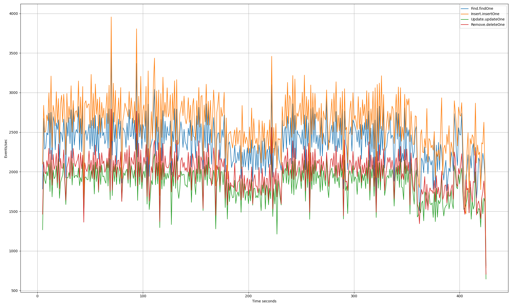

# Summary
This directory is meant to house analysis tools/sripts to inspect the
results of your local genny runs.

## Installation
It is recommended to use a virtual environment, but to run the script from the root of the genny repository to make the paths to the workload output more sane.
```sh
# Setup a python venv with the right reqs.
python3 -mvenv venv
./venv/bin/python3 -mpip install -r ./src/workloads/contrib/graph/requirements.txt

# Run the script.
./venv/bin/python3 ./src/workloads/contrib/analysis/test_result_graph.py
```
# Example

